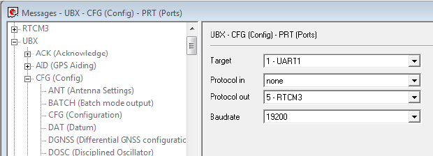
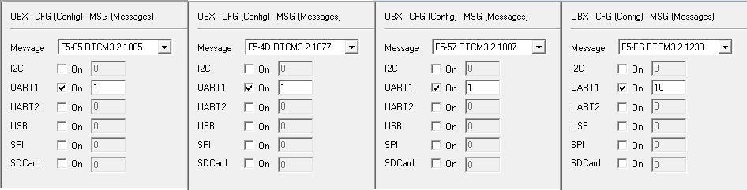

## Overview

The driver was originally written by Johannes Meyer, and the source is found [here](https://github.com/KumarRobotics/ublox).

This package is for the rover of RTK-DGNSS implementation on ROS.

The configuration setting of base and rover is described in the following section.

## Configuration Setting

First of all, we need configuration program, **u-center**, in Window platform. Download link is [here](https://www.u-blox.com/en/product/u-center).

### Base station

1. Run U-center.

2. Firmware setting

   * Download firmware file from [here](https://www.u-blox.com/en/ubx-viewer/view/NEO-M8P-FW301-HPG140_RNwithFW.zip?url=https%3A%2F%2Fwww.u-blox.com%2Fsites%2Fdefault%2Ffiles%2FNEO-M8P-FW301-HPG140_RNwithFW.zip)
   * In the U-center, go to *Toos - Firmware Update Utility*.
   * Select *Firmware image* file that contains word of *REFERENCE*. (firmwares for the base and rover are different )
   * Select *Flash Information Structure(FIS)* file, which can be found in the program folder of u-center, **'flash.xml'**.
   * Click the *go* button at the left bottom corner.

3. Configure setting

   * In the U-center, *go to View - Messages View - UBX - CFG - TMODE3*.

   * Select *Survey-in* mode and insert proper survey conditions (in case of you have the known base position, select *Fixed position* mode).

   * Set the port config, in the *UBX - CFG - PRT*, (DO NOT change baudrate)

     

     

   * Set the RTCM message confg, int the *UBX - CFG - MSG*. 

   

   * Save the configuration setting. *UBX - CFG - CFG*, click both *send* button at the left bottom of the message view, and *save icon* button at the right top of the program.

   * You can monitor the survey-in progress in the *UBX - NAV - SVIN*.

### Rover 

1. Run U-center.

2. Firmware setting
   * Same with process with *Base station*, but only different with the firmware file, which has the word of *ROVER*.

3. Configuration setting
   * All of you have to set the configure of the rover is a **port setting**. In the section of *UBX - CFG - PRT*, set the protocol-in to *5-RTCM3*, but the protocol-out to *none*. Target and baudrate are the same with the one of the base station.


## ROS Operation of Rover

1. Clone this git to your ROS catkin workspace and build.

2. Check your device port number(`$ ls -l /dev/ttyACM*`), and gives permission (`sudo chmod +777 /dev/ttyACM0`)

3. You can change parameters by editing `/ublox_gps/config/c94_m8p_rover.yaml` file.

4. Run node.

   ```bash
   $ roslaunch ublox_gps ublox_device.launch
   ```

   

   * Global position topic: /rover/fix

5. Visualization.

   ```bash
   $ roslaunch rviz_satellite demo.launch
   ```

   